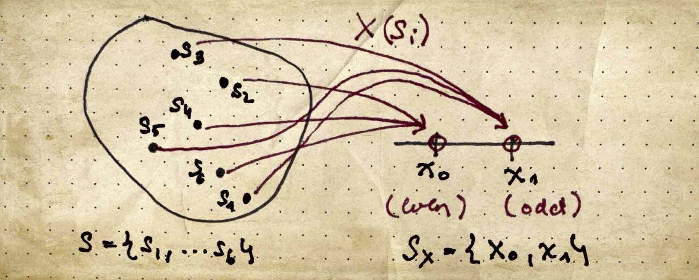

# **Problem Set 1 / Problem 1 \-** _Die toss experiment_

Consider a die toss experiment with sample space $S$ and a one-to-one mapping from the sample space $S$ into the set of real numbers $S_X$.

```math
S=\{s_1, s_2, s_3, s_4, s_5, s_6\}
```

```math
S_X=\{x_1, x_2, x_3, x_4, x_5, x_6\}
```

**(a)** Sketch the mapping from the sample space $S$ into the set of real numbers $S_X$


**(b)** Sketch the probability mass function (PMF) and cumulative distribution function (CDF)


**(c)** Using the CDF, what is the probability, that $P(1 < X \le 4)$

```math
P(1 < X \le 4)=F_X(4)-F_X(1)=\frac{4}{6}-\frac{1}{6}=\frac{3}{6}=\frac{1}{2}
```

**(d)** How would the mapping look like for a many-to-one mapping from the sample space $S$ into a different $S_X$, where $x_0$ represents all even numbers and $x_1$ represents all odd numbers?

```math
S_X = \{x_0, x_1\}
```

