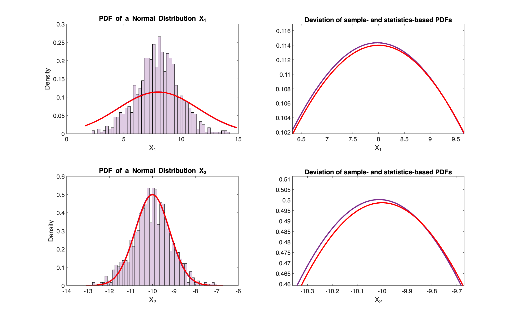
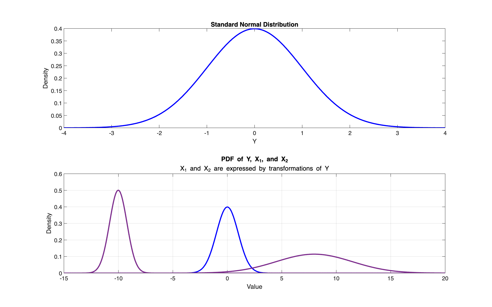
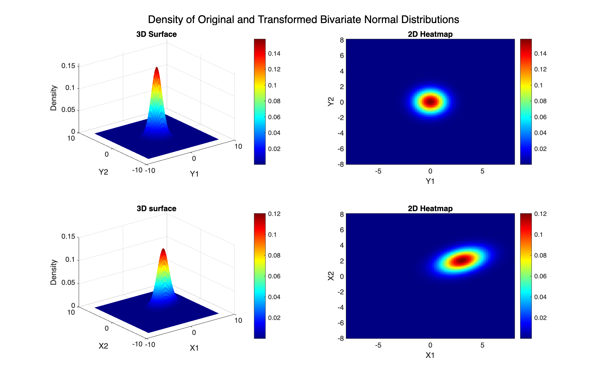

#  **Problem Set 1 / Problem 2 \-** *Mean and Variance of Random Variables*

 **Given** $Y$ **and** $X$ **random variables (RV).** 


 $X$ has mean and variance of $\mu_X$ and $\sigma_X^2$ , respectively.


 $Y$ is defined as:

 $$ Y=\frac{X-E\left(X\right)}{\sqrt{\textrm{Var}\left(X\right)}}=\frac{X-\mu_X }{\sqrt{\sigma_X^2 }} $$ 
# Task 1

 **Analytically compute** $E\left(Y\right)$ **.**


**Utilizing:**


```math
a+b*E\left(V\right)=E\left(a+b*V\right)
```


```math
E\left(Y\right)=E\left(\frac{X-E\left(X\right)}{\sqrt{\textrm{Var}\left(X\right)}}\right)
```


```math
E\left(Y\right)=\frac{1}{\sqrt{\textrm{Var}\left(X\right)}}*E\left(X-E\left(X\right)\right)=\frac{1}{\sqrt{\textrm{Var}\left(X\right)}}*\left(E\left(X\right)-E\left(X\right)\right)=\frac{1}{\sqrt{\textrm{Var}\left(X\right)}}*0=0
```

# Task 2

 **Analytically compute** $\textrm{Var}\left(Y\right)$ **.**


**Utilizing:**


```math
b^2 *\textrm{Var}\left(V\right)=\textrm{Var}\left(a+b*V\right)
```


```math
\textrm{Var}\left(Y\right)=\textrm{Var}\left(\frac{X-E\left(X\right)}{\sqrt{\textrm{Var}\left(X\right)}}\right)
```


```math
\textrm{Var}\left(Y\right)={\left(\frac{1}{\sqrt{\textrm{Var}\left(X\right)}}\right)}^2 *\textrm{Var}\left(X\right)=\frac{1}{\textrm{Var}\left(X\right)}*\textrm{Var}\left(X\right)=\frac{\textrm{Var}\left(X\right)}{\textrm{Var}\left(X\right)}=1
```

# Task 3

 **Interpret the resulting random variable** $Y$ **.**


 $Y$ is expressed by the RV of $X$ , for which the participating statistics, that is the *Expected Value (mean)* and the *Variance* can be choosen arbitrarily.


Regardless of the values of $X$ , $Y$ has an *expected value* of 0 and a *variance* of 1. Therefore, $Y$ can be seen as a function which takes an arbitrary RV $X$ as input, and transforms it into a RV with *mean* of 0 and *variance* of 1.


This is essentially the **standardization** function, which, considering a *normal (Gaussian) distribution* for the RV's, shifts the position of the distribution to be centered around zero and squeezes or stretches it to have a *standard deviation* (and *variance*) of 1, utilizing the arbitrarily choosen statistics, $E\left(X\right)$ and $\textrm{Var}\left(X\right)$ .

# Task 4

**Reformulate the equation and show how an RV with arbitrary mean and variance can be obtained based on a standard Gaussian RV. Verify your insight in Matlab.**


Since the *standard Gaussian RV* is $Y$ , we need to express $X$ by $Y$ from the equation.

```math
X=E\left(X\right)+\textrm{Var}\left(X\right)*Y
```

As for an example RV $X_1$ with *expected value* of 8 and *variance* of 3.5,

```math
X_1 =E\left(X_1 \right)+\mathrm{Var}\left(X_1 \right)*Y=8+3\ldotp 5*Y
```

And as for RV $X_2$ , \-10 and 0.8, respectively,

```math
X_2 =E\left(X_2 \right)+\mathrm{Var}\left(X_2 \right)*Y=-10+0\ldotp 8*Y
```

Verification through visualizations:



We can see that using 1000 data points as the sample of $Y$ in both of the above samples, by scaling and shifting by the arbitrary statistics of $X$ , we get a close approximation of the PDF associated with the given and desired statistics.



### Task 5

**Based on the previous task, find a method to generate a random vector with arbitrary mean vector and arbitrary (hermitian and positive definite) covariance matrix based on a standard multivariate Gaussian random vector.**


We are dealing with a similar situation as in **Task 4**, in the sense of transforming a normal distribution into a new one with arbitrary mean and variance. Yet here, instead of a single *RV* and its corresponding PDF plotted on a 2\-dimensional plane, we go into additional dimensions, such as $D=n+1$ , where $n\ge 2$ denotes the number of *RV*'s.


Considering $D=2$ , we arrive at the following initial setup compared to *Task 4*:

|                                                                                 |                                                                                                                      |
| :------------------------------------------------------------------------------ | :------------------------------------------------------------------------------------------------------------------- |
| **Task 4** <br>                                                                 | **Task 5** <br>                                                                                                      |
| **single** *RV* of $Y$ <br>                                                     | **multiple** *RV*'s of, $Y_1, Y_2$ <br>                                                                              |
| $\displaystyle Y \sim N\left(0,1\right)$ <br>                                   | $\displaystyle Y_1 ,Y_2  \sim N\left(0,1\right)$ <br>                                                                |
| $\displaystyle D=\left(n+1\right)=\left(1+1\right)=2$ <br>                      | $\displaystyle D=\left(n+1\right)=\left(2+1\right)=3$ <br>                                                           |
| data points in a single dimension <br>                                          | data points in a two dimensional space (plane) <br>                                                                  |
| density function of *RV* is obtained and displayed in the second dimension <br> | density function is obtained for both *RV*, with covariance considered, they form a density surface in 3D space <br> |
|                                                                                 |                                                                                                                      |


As for the transformation:

|                        |                                                                                                |
| :--------------------- | :--------------------------------------------------------------------------------------------- |
| **Task 4** <br>        | **Task 5** <br>                                                                                |
| from $Y$ to $X_1$ <br> | from $Y_1 ,Y_2$ to $X_1 ,X_2$ <br>                                                             |
| single mean <br>       | vector of means: $M=\left\lbrack \mu_1 ,\mu_2 \right\rbrack$ <br>                              |
| single variance <br>   | variance for each *RV* accompanied by their covariance (denoted below as $C_{X_1, X_2}$ ) <br> |
|                        |                                                                                                |


```math
 C_{X_1, X_2}=\left\lbrack \begin{array}{cc} \mathrm{Var}\left(X_1 \right) & \mathbf{Cov}\left({\mathit{\mathbf{X}}}_1 ,{\mathit{\mathbf{X}}}_2 \right)\newline \mathbf{Cov}\left({\mathit{\mathbf{X}}}_1 ,{\mathit{\mathbf{X}}}_2 \right) & \mathrm{Var}\left(X_2 \right) \end{array}\right\rbrack
 ```


With concrete values:


Given the *standard normal (Gaussian) distributions*, $Y_1$ and $Y_2$ ,

 $$ Y_1 ,Y_2  \sim N\left(0,1\right) $$ 

Given the following arbitrary *mean vector* and *covariance matrix*,


```math
M=\left\lbrack 3,2\right\rbrack
```

```math
C=\left\lbrack \begin{array}{cc} 2 & 0\ldotp 5\newline 0\ldotp 5 & 1 \end{array}\right\rbrack
```

The transformations to obtain $X_1 ,X_2$ is visualized as follows:



