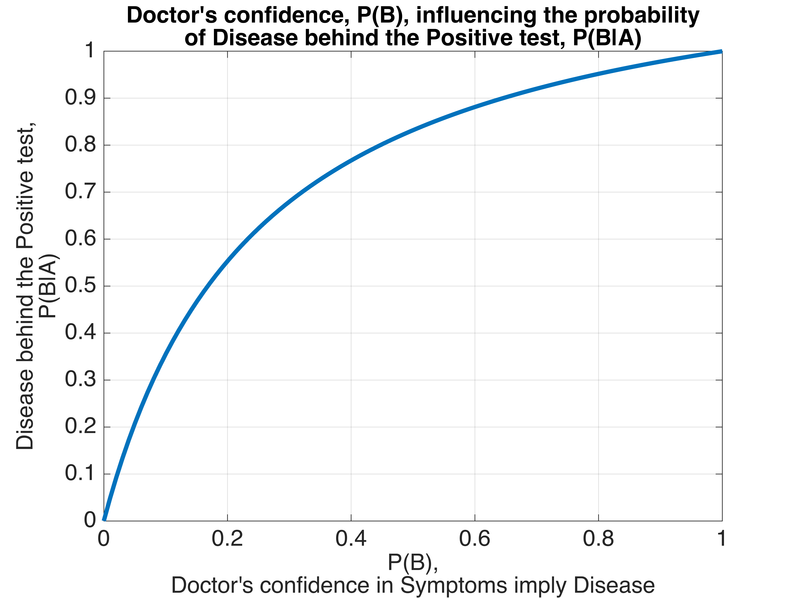

# **Problem Set 1 / Problem 3 \-** _Bayes' theorem_

Given the following events:

```math
A=\{\text{test is positive}\} \\
B=\{\text{person has the disease}\}
```

```math
A^C=\{\text{test is negative}\} \\
B^C=\{\text{person does not have the disease}\}
```

**(a) Identify the following probabilities $P(B), P(A|B), P(A|B^C)$, and $P(A^C|B)$**

**(a.1)** $P(B)$

It is given in the description that a patient with the given symptoms has a probability of $0.5$ to **have the disease**. This knowledge is taken for granted, from cases in the past.

```math
P(B)=P(\text{person has the disease})=0.5
```


**(a.2)** $P(A|B)$

This is the probability of the patient being **tested positive** if they really **has the disease**, that is the _True Positive Rate (TPR)_, to which we refer as _sensitivity_. It is given in the description as $0.99$.

It is an indicator of how well the test procedure performs considering only the patients with the disease based on the previous tests.

```math
P(A|B)=P(\text{test is positive} \ | \ \text{person has the disease})=0.99
```


**(a.3)** $P(A|B^C)$

This is the probability of the patient being **tested positive** if they **does not have the disease**, that is the _False Positive Rate (FPR)_. It is given in the description as $0.2$.

```math
P(A|B^C)=P(\text{test is positive} \ | \ \text{person doess not have the disease})=0.2
```


**(a.4)** $P(A^C|B)$

This is the probability of the patient being **tested negative** if they really **has the disease**, that is the _False Negative Rate (FNR)_. This is $(1-\text{sensitivity})=0.01$.

```math
P(A^C|B)=P(\text{test is negative} \ | \ \text{person has the disease})=0.01
```


**(b) Derive the probability that the test is positive $P(A)$**

This is the probability of the patient being **tested positive** regardless of the **presence of the disease**. Therefore the probabilities of the two disjoint events can be added together as:

```math
P(A) = P(A|B) * P(B) + P(A|B^C) * P(B^C) \\
= 0.99 * \frac{1}{2} + 0.2 * \frac{1}{2} \\
= 0.595
```

This, however can be expressed with _Bayes' theorem_ as well such as:

> _Bayes' theorem_:
> 
> ```math
> P(E|C)=\frac{P(EC)}{P(C)}=\frac{P(C|E)*P(E)}{P(C)}
> ```

That is,

```math
P(A|B) * P(B) = P(AB)
```

```math
P(B|A) * P(A) = P(AB)
```

To express $P(A)$, we use the already known values of $P(AB)$, which is $0.595$. That is,

```math
0.99 * 0.5 = 0.595
```

```math
P(B|A) * P(A) = 0.595
```

As for $P(B|A)$, we need to calculate the proportion of true positive values of all the positive test procedure outcomes. This is the following, which is called _precision_,

```math
P(B|A) = \frac{0.99}{0.99 + 0.2} = 0.832
```

Then the equation becomes,

```math
0.8319 * P(A) = 0.595
```

```math
P(A) = \frac{0.595}{0.832} = 0.715
```

**(c) Use $P(A, B) = P(A|B) * P(B)$ to find a connection between $P(A|B)$ and $P(B|A)$**

The left hand side denotes the probability that both $A$ and $B$ events occur at the same observation. The right hand side expresses this same happening using a conditional probability and the probability of the condition itself. The conditional variable can be switched to the other variable, to $A$, resulting in the same probability, the probability of the intersection, $P(A \cap B)$, $P(A, B)$, or as denoted below, $P(AB)$.

```math
P(AB) = P(A|B) * P(B)
```

```math
P(AB) = P(B|A) * P(A)
```

```math
P(A|B) * P(B) = P(B|A) * P(A)
```

```math
P(A|B) = \frac{P(B|A) * P(A)}{P(B)}
```

With the last equation, we arrive at _Bayes' theorem_, with which, we can find the conditional probability of an event by switching the roles in the original condition (probability of the condition given the event of interest) and using the individual probabilities of both events.

**(d) A critical parameter in this example is the experience of the doctor saying that a person with these symptoms has the disease with probability $0.5$. Derive a formula of $P(B|A)$ as a function of $P(B)$ and sketch it for $P(B) = [0, 1]$. This function fulfills $P(B|A) > P(B)$. What does that mean?**

A function can be built, using the _Bayes' formula_ where $P(B)$ is a free parameter, while $P(A)$ also incorporates $P(B)$, so we need to express those with other formulas.

```math
P(B|A) = \frac{P(A|B) * P(B)}{P(A)}
```

The objective is to see, how the probability of a positive test while having the disease changes as the doctor's opinion changes.



The function indeed fulfills $P(B|A) > P(B)$. Given the doctor's confidence level on the connection between the symptoms and the disease, whatever low that is, issuing a test yields significantly better confidence level, than just relying on the doctor's opinion.